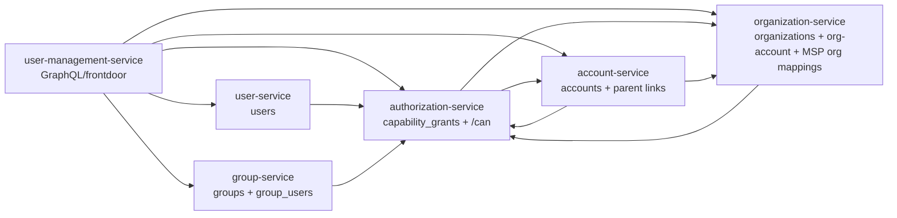
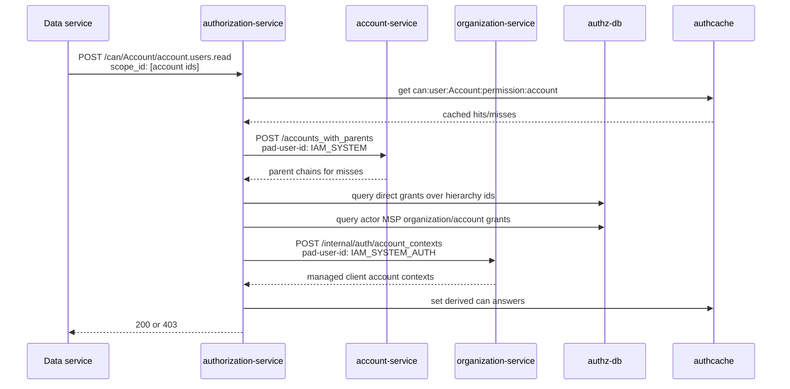
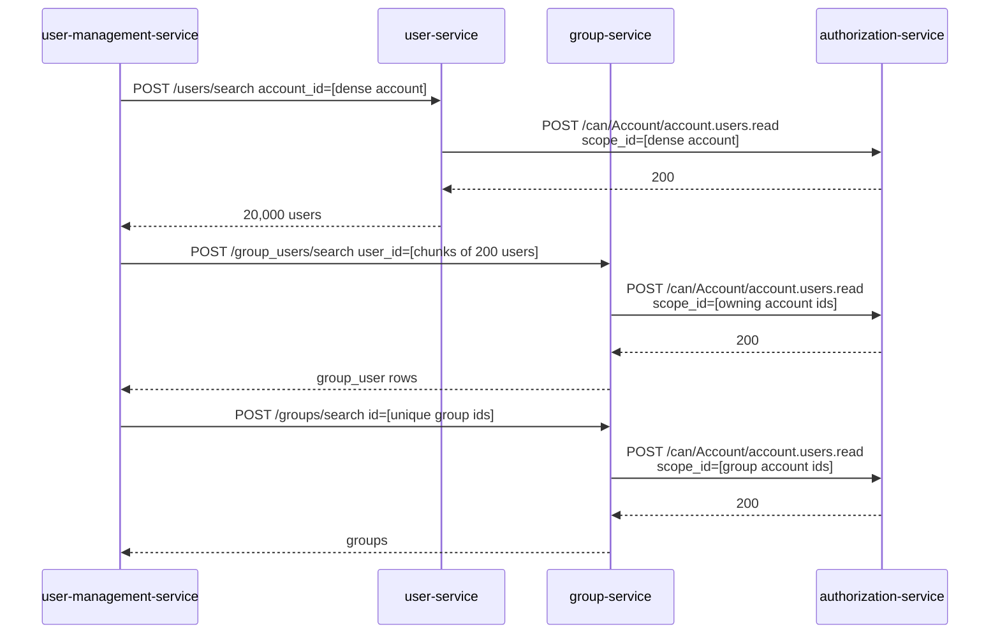
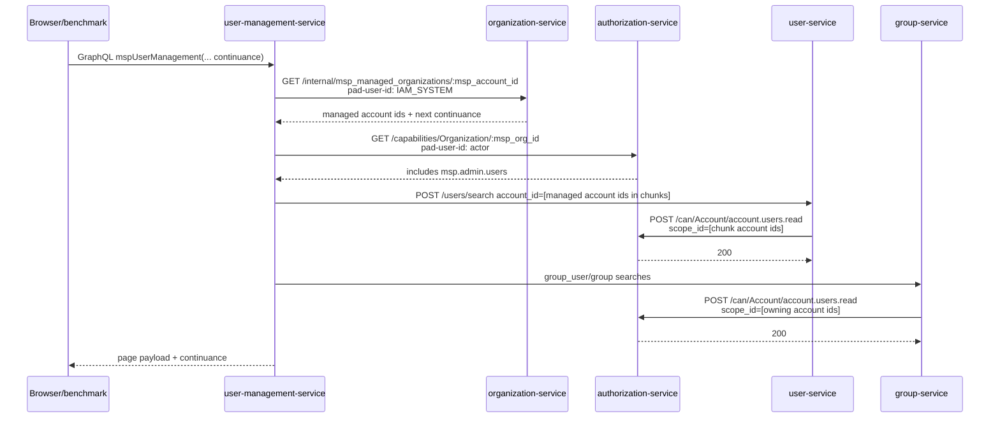

# Final Architecture

This document records the IAM demo architecture as implemented. It focuses on the guiding principles, service-owned tables, cross-service authorization model, special REST requests, and the cache boundaries that make the benchmarked pathological queries work.

Both GitHub and GitLab render Mermaid diagrams directly from fenced `mermaid` code blocks in Markdown. GitHub documents diagram rendering in Markdown files, issues, pull requests, discussions, and wikis: <https://docs.github.com/en/get-started/writing-on-github/working-with-advanced-formatting/creating-diagrams>. GitLab documents diagram and flowchart support in GitLab Flavored Markdown: <https://docs.gitlab.com/user/markdown/#mermaid>. This file therefore embeds Mermaid directly instead of linking generated images.

## Guiding Principles

1. Services own their domain records. Other services may ask questions about those records, but must not cache or persist another service's owned objects as source-of-truth data.
2. Authorization callers ask specific questions: "can this actor perform this action on these scopes?" They do not fetch broad capability lists and interpret policy locally except at app-facing/demo boundaries where a capability list is itself the requested API.
3. Authorization is account-scope aware. Returned users, groups, group memberships, and accounts are authorized by their owning account scope.
4. Collection reads authorize the collection's distinct account scopes, not each returned row independently. This is still per-object in the important sense: every returned object's owning account is included in an authorization decision.
5. `/can` is the internal service-to-service authorization workhorse. Keep its contract stable unless the task is explicitly changing that contract.
6. MSP authority is organization-level. MSP ownership is not `msp_account_id -> managed_account_id`. That account-level reflected-grant model is invalid and has been removed.
7. MSP-specific grants such as `msp.admin.users` are visible only in MSP organization context. Account-context capability results must not include `msp.*` grants.
8. `IAM_SYSTEM` is a trusted internal identity for intra-system reads and projections. Never convert a real actor/user request into `IAM_SYSTEM` to bypass authorization.
9. `IAM_SYSTEM_AUTH` is narrower than `IAM_SYSTEM`. It is used by authorization-service to ask organization-service for relationship facts needed to answer authorization questions.
10. Caches may store service-owned derived answers inside the owning service, or authorization-service's derived authorization answers. Caches must not turn another service's domain objects into local source-of-truth copies.

## Service Ownership



## Table Layouts

### user-service

Owns users.

| Table | Key fields | Notes |
| --- | --- | --- |
| `users` | `id`, `account_id`, profile fields | `account_id` is indexed and is the authorization scope for user reads. |

### account-service

Owns accounts and parent-child account hierarchy.

| Table | Key fields | Notes |
| --- | --- | --- |
| `accounts` | `id`, `name`, `parent_account_id` | `parent_account_id` is a self-reference and is indexed. Account-service is the source of truth for parent chains. |

### group-service

Owns groups and user/group membership rows.

| Table | Key fields | Notes |
| --- | --- | --- |
| `groups` | `id`, `account_id`, `name` | `account_id` is indexed and is the authorization scope for group reads. |
| `group_users` | `id`, `group_id`, `user_id` | `group_id` and `user_id` are indexed. Membership reads authorize via the owning groups' account IDs. |

### organization-service

Owns organizations, organization-account membership, and MSP organization relationships.

| Table | Key fields | Notes |
| --- | --- | --- |
| `organizations` | `id`, `account_id`, `name` | `account_id` is indexed. |
| `organization_accounts` | `id`, `organization_id`, `account_id` | Both IDs are indexed. This is the source of truth for account membership in an organization. |
| `msp_managed_organizations` | `msp_organization_id`, `msp_account_id`, `client_organization_id` | Models MSP authority at organization level. `client_organization_id` is validated unique by the model; the current schema does not enforce that with a unique index. |

### authorization-service

Owns grants and derived authorization answers.

| Table | Key fields | Notes |
| --- | --- | --- |
| `capability_grants` | `user_id`, `permission`, `scope_type`, `scope_id` | Unique index on user/permission/scope. MSP organization grant lookup is indexed for `msp.%` organization grants. |
| `capabilities` | `subject_id`, `account_id`, `permission` | Legacy/simple capability table still present. Current app-facing work is through `capability_grants`. |

## Source Of Truth Boundaries

| Fact | Source of truth | Who may cache it |
| --- | --- | --- |
| Account parent chain | account-service | account-service may cache `account_with_parents:<account_id>`. |
| Organization membership for accounts | organization-service | organization-service may cache account-id lists by organization. |
| MSP manages client organization | organization-service | organization-service owns `msp_managed_organizations`. |
| User profile rows | user-service | user-service only. |
| Group rows and group memberships | group-service | group-service only. |
| Capability grants | authorization-service | authorization-service only. |
| Specific authorization result | authorization-service | authorization-service may cache derived `can:{user}:Account:{permission}:{account_id}` answers. |

Important: authorization-service does not cache account parent records. It calls account-service for hierarchy facts, then caches only derived authorization answers/capability arrays with TTLs.

## Authorization Model

The core service-to-service authorization API is:

```text
GET|POST /can/:scope_type/:permission
body: { "scope_id": ["..."] }
header: pad-user-id: <actor user id>
```

For account scope, authorization-service answers the batch using `Authorization::Capabilities#account_ids_with_permission`:

1. Normalize requested account IDs.
2. Check authorization-service Redis for per-user/per-account/per-permission answers.
3. For misses, ask account-service for parent chains in one batch using `IAM_SYSTEM`.
4. Check direct account grants across all hierarchy IDs.
5. Check MSP-reflected account permissions by asking organization-service for relationship context using `IAM_SYSTEM_AUTH`.
6. Cache only the final derived true/false answer per `(user, account, permission)`.



For organization scope, `/can` currently checks a direct organization grant:

```text
scope_type = "Organization"
permission = organization.read.accounts, organization.accounts.read, organization.read, etc.
scope_id = organization_id
```

## App-Facing Capabilities API

The intended app-facing proof API is:

```text
GET /capabilities/Organization/:organization_id
GET /capabilities/Account/:account_id
```

Organization capabilities are direct organization-scoped grants.

Account capabilities include direct/cascaded account grants using parent-chain semantics and MSP reflection, but must exclude `msp.*` permissions in account context. MSP-specific grants stay visible in MSP organization context.

This API returns capability names because the caller is asking for a capability listing. This is separate from the internal `/can` model, where services ask a precise yes/no question.

## Query Execution Patterns

### Dense Account Query

Dense expands one account to users and each user's groups.



Dense does not issue 60,000 authorization requests. It returns a large payload, but authorization collapses by distinct account scope.

### MSP Fanout Query

MSP fanout uses:

```graphql
mspUserManagement(mspAccountId: "...", as: "...", continuance: "...") {
  loading
  loadedCount
  totalCount
  continuance
  accounts { id users { id email accountId groups { id name } } }
}
```

There is no client-facing page-size argument. The organization-service internal default is currently 1,000 managed accounts per page.



The benchmarked 100k fanout walks 99,999 accounts over 100 continuation pages. The cost is dominated by repeated payload hydration and serialization, not per-row authorization.

## Special REST Requests

This section documents special endpoints that are not ordinary CRUD.

### authorization-service

#### `GET|POST /can/:scope_type/:permission`

Purpose: internal service-to-service authorization decision.

Caller identity: `pad-user-id`.

Body:

```json
{ "scope_id": ["uuid", "uuid"] }
```

Semantics:

- `IAM_SYSTEM` is automatically allowed.
- `Account` scope uses batched account capability checks.
- `Organization` scope checks direct organization grant existence.
- Returns `200` when all requested scopes are authorized, `403` otherwise.
- `POST` is the normal batched form. `GET` exists for compatibility/simple probes.

#### `GET /capability_grants` and `GET /capability_grants/:id`

Purpose: ordinary read endpoints for grant records.

Caller identity: current implementation exposes index/show without an extra special trust header.

Semantics:

- These are Rails resource read endpoints, not part of the cross-service authorization proof.
- They are documented here because they are explicit public routes in authorization-service.

#### `GET /capabilities/Organization/:organization_id`

Purpose: app-facing capability listing for an organization context.

Caller identity: `pad-user-id`.

Semantics:

- Returns direct organization-scoped capability names.
- MSP permissions such as `msp.admin.users` are valid here when granted on the MSP organization.

#### `GET /capabilities/Account/:account_id`

Purpose: app-facing capability listing for an account context.

Caller identity: `pad-user-id`.

Semantics:

- Returns direct/cascaded account capabilities.
- Reflects MSP account grants only when the organization relationship proves the MSP manages the client organization.
- Excludes `msp.*` grants in account context.

#### `GET /internal/admin_users/organization/:organization_id`

Purpose: internal fixture/demo helper to find an organization admin grant.

Caller identity: requires `pad-user-id: IAM_SYSTEM`.

Returns the first `organization.accounts.create` grant for the organization, or `404`.

### account-service

#### `POST /accounts_with_parents`

Purpose: batched account parent-chain lookup.

Caller identity: requires `pad-user-id: IAM_SYSTEM`.

Body:

```json
{ "account_ids": ["uuid", "uuid"] }
```

Semantics:

- Returns one parent-chain array per requested account.
- Account-service owns and may cache these account hierarchy records.
- Authorization-service uses this endpoint to answer account-scope authorization questions. This does not transfer ownership of account parent records to authorization-service.

#### `GET /account_with_parents/:account_id`

Purpose: single account parent-chain lookup.

Caller identity:

- `IAM_SYSTEM` may read directly.
- Real actors require `account.read` on the requested account.

#### `POST /accounts/search`

Purpose: filtered account lookup.

Caller identity:

- `IAM_SYSTEM` may read directly.
- Real actors require `account.read` over the distinct requested/returned account IDs.

Body filters:

- `id: []`

Semantics:

- Used by GraphQL data loading and demo views when account rows need to be hydrated in batches.

#### `GET /accounts`

Purpose: account collection read.

Caller identity:

- `IAM_SYSTEM` may read directly.
- Real actors require `account.read` over the distinct returned account IDs.

Query filters:

- `id`

#### `GET /accounts/:id`

Purpose: account row read.

Caller identity:

- `IAM_SYSTEM` may read directly.
- Real actors require `account.read` on the account.

### organization-service

#### `POST /organization_account_ids/for_account_ids`

Purpose: map account IDs to their organization context and organization account-id set.

Caller identity:

- `IAM_SYSTEM` may read directly.
- Real actors require `account.read` over the requested account IDs.

Semantics:

- Used by account-service to compute account parent chains constrained by organization membership.
- Organization-service owns and may cache organization account-id lists.

#### `GET /organization_account_ids/for_account_id/:account_id`

Purpose: single-account form of the organization account-id lookup.

Caller identity:

- `IAM_SYSTEM` may read directly.
- Real actors require `account.read` on the requested account.

#### `GET /organization_accounts`

Purpose: filtered organization-account membership reads.

Caller identity:

- `IAM_SYSTEM` may read directly.
- `organization_id` filter requires organization account-read capability.
- `account_id` filter requires account read.

#### `GET /organization_accounts/:id`

Purpose: read one organization-account membership row.

Caller identity:

- Current implementation returns the row directly by ID.
- Treat this as a demo/read-model endpoint, not a privileged relationship-fact API.

#### `GET /organizations`

Purpose: organization collection read.

Caller identity:

- Current implementation requires a filter, builds `results`, but renders `@organizations` and does not perform a collection authorization check.
- Treat this as an existing demo bug/gap, not a reliable cross-service authorization endpoint.

#### `GET /organizations/:id`

Purpose: organization row read.

Caller identity:

- `IAM_SYSTEM` may read directly.
- Real actors require `organization.read` on the organization.

#### `GET /organizations/accounts/counts/:organization_id`

Purpose: count accounts in an organization.

Caller identity:

- `IAM_SYSTEM` may read directly.
- Real actors require `organization.read.accounts` or `organization.accounts.read`.

#### `GET /internal/random/organization`

Purpose: demo helper for picking a random organization.

Caller identity: internal/demo-only route.

- Current implementation requires `pad-user-id: IAM_SYSTEM`.

#### `GET /internal/random/organizations/:organization_id/account`

Purpose: demo helper for picking a random account inside an organization.

Caller identity: internal/demo-only route.

- Current implementation requires `pad-user-id: IAM_SYSTEM`.

#### `POST /internal/auth/account_contexts`

Purpose: narrow authorization context lookup for MSP reflection.

Caller identity: requires `pad-user-id: IAM_SYSTEM_AUTH`.

Body shape:

```json
{
  "contexts": [
    {
      "msp_organization_id": "uuid",
      "msp_account_id": "uuid",
      "accounts": [
        {
          "account_id": "uuid",
          "parent_account_ids": ["uuid"]
        }
      ]
    }
  ]
}
```

Semantics:

- Verifies the MSP account belongs to the MSP organization.
- Verifies the MSP organization/account manages the client organization containing the target account.
- Returns only account contexts proven to be managed by that MSP organization/account pair.
- Filters parent IDs down to parent accounts inside the client organization.
- This is not a general replacement for `IAM_SYSTEM`.

#### `GET /internal/msp_managed_organizations/:msp_account_id`

Purpose: internal paginated managed-account listing for the MSP demo GraphQL field.

Caller identity: requires `pad-user-id: IAM_SYSTEM`.

Query params:

- `continuance`: offset cursor.
- `limit`: accepted internally and clamped to the service max. The public GraphQL API does not expose this as `pageSize`.

Response:

```json
{
  "msp_organization_id": "uuid",
  "msp_account_id": "uuid",
  "managed_account_ids": ["uuid"],
  "total_count": 99999,
  "continuance": "1000"
}
```

Semantics:

- Lists accounts belonging to organizations managed by the MSP account's MSP organization relationship.
- Current internal page size is 1,000.

### user-service

#### `GET /users`

Purpose: user collection read.

Caller identity:

- `IAM_SYSTEM` may read directly.
- Real actors require `account.users.read` over distinct returned account IDs.

#### `GET /users/:id`

Purpose: user row read.

Caller identity:

- `IAM_SYSTEM` may read directly.
- Real actors require `account.users.read` on the user's account.

#### `POST /users/search`

Purpose: filtered user collection lookup used by GraphQL batching.

Caller identity:

- `IAM_SYSTEM` may read directly.
- Real actors require `account.users.read` over the distinct account IDs in the result set.

Body filters:

- `account_id: []`
- `id: []`

Semantics:

- Authorizes by distinct account IDs, not per returned row.

#### `GET /accounts/users/counts`

Purpose: user counts grouped by account.

Caller identity:

- `IAM_SYSTEM` may read directly.
- Real actors require `account.users.read` over requested account IDs.

Query/body shape:

- Accepts account IDs as `account_id[]=...` request parameters.

### group-service

#### `GET /group_users`

Purpose: group membership collection read.

Caller identity:

- `IAM_SYSTEM` may read directly.
- Real actors require `account.users.read` over the distinct account IDs of the referenced groups.

#### `GET /group_users/:id`

Purpose: group membership row read.

Caller identity:

- `IAM_SYSTEM` may read directly.
- Real actors require `account.users.read` over the owning group's account.

#### `POST /group_users/search`

Purpose: filtered group membership lookup.

Caller identity:

- `IAM_SYSTEM` may read directly.
- Real actors require `account.users.read` over the distinct account IDs of the referenced groups.

Body filters:

- `group_id: []`
- `user_id: []`
- `id: []`

#### `GET /groups`

Purpose: group collection read.

Caller identity:

- `IAM_SYSTEM` may read directly.
- Real actors require `account.users.read` over distinct returned account IDs.

#### `GET /groups/:id`

Purpose: group row read.

Caller identity:

- `IAM_SYSTEM` may read directly.
- Real actors require `account.users.read` over the group's account.

#### `POST /groups/search`

Purpose: filtered group lookup.

Caller identity:

- `IAM_SYSTEM` may read directly.
- Real actors require `account.users.read` over the distinct account IDs of returned groups.

Body filters:

- `account_id: []`
- `id: []`
- `name: []`

#### `GET /accounts/groups/counts`

Purpose: group counts grouped by account.

Caller identity:

- `IAM_SYSTEM` may read directly.
- Real actors require `account.users.read` over requested account IDs.

Query/body shape:

- Accepts account IDs as `account_id[]=...` request parameters.

### user-management-service

user-management-service is the app-facing composition service. Its REST routes are demo/UI entry points rather than source-of-truth data APIs.

#### `POST /graphql`

Purpose: app-facing GraphQL execution endpoint.

Semantics:

- Hosts the regular organization/user/account demo fields and the restored `mspUserManagement` field.
- Calls the data services and authorization-service rather than reading their databases directly.

#### `GET /graphiql`

Purpose: mounted GraphiQL development console for the app-facing GraphQL endpoint.

#### `GET /demo_queries/:id`

Purpose: frontdoor benchmark/demo query launcher.

Semantics:

- Provides named pathological/demo requests such as dense expansion and MSP fanout.
- The MSP demo URLs currently include 100k, 50k, and 10k fanout cases.

#### `GET /frontdoor/index`

Purpose: demo landing/index page for query links.

#### `GET /frontdoor/random_record`

Purpose: demo helper that picks a random organization/account/user shape.

#### `GET /frontdoor/random_record/:organization_id/:account_id`

Purpose: demo detail helper for a selected organization/account pair.

#### `GET /organization_user_management`

Purpose: app-facing organization user-management page.

Semantics:

- Composes organization/account/user/group data through service clients.

#### `GET /organization_user_management/partition`

Purpose: partitioned variant of the organization user-management demo view.

#### `GET /accounts/:id`, `GET /slow_accounts/:id`, `GET /slowest_accounts/:id`, `GET /debug`

Purpose: demo comparison/debug views.

Semantics:

- These are intentionally app-facing demo routes. They should not be treated as service-owned data APIs.

### Shared Service Routes

Each Rails service also exposes:

```text
POST /graphql
GET /up
```

`POST /graphql` is the service-local GraphQL endpoint where present. `GET /up` is the Rails health check route.

## Cache Inventory

| Cache owner | Key shape | Contains | Boundary |
| --- | --- | --- | --- |
| account-service | `account_with_parents:<account_id>` | Account parent-chain payloads | Allowed: account-service owns accounts. |
| account-service | `org_cachekeys:<organization_id>` | Cache-key invalidation set for account parent chains | Derived/indexing support inside owning service boundary. |
| organization-service | `account_ids_by_organization:<organization_id>` | Account IDs in an organization | Allowed: organization-service owns organization membership. |
| authorization-service | `capabilities:<user>:Organization:<org_id>` | Derived organization capability names | Allowed: auth owns grants and derived answers. |
| authorization-service | `capabilities:<user>:Account:<account_id>` | Derived account capability names | Allowed: auth owns derived answers; excludes `msp.*` in account context. |
| authorization-service | `can:<user>:Account:<permission>:<account_id>` | Derived true/false decision | Allowed: auth owns derived answers. |

Do not add caches in authorization-service for account parent records, organization membership lists, user rows, group rows, or group membership rows.

## Benchmark-Proven Shape

The latest full continuation benchmark used:

```text
RUNS=1 CACHE_WAIT_SECONDS=0 bash benchmark_demo.sh
```

Output:

```text
data/development/benchmark-runs/20260630-continuance-msp-1452/timings.csv
```

Representative results:

| Phase | Dense full expansion | 100k MSP fanout | 50k MSP fanout | 10k MSP fanout |
| --- | ---: | ---: | ---: | ---: |
| startup cold | 12.202s | 672.533s | 285.956s | 46.543s |
| cold after Redis flush | 11.312s | 677.693s | 278.562s | 45.045s |
| warm | 10.967s | 686.220s | 281.135s | 46.276s |

Dense returns:

```text
1 account
20,000 users
40,006 returned group memberships
8 unique groups
~5.7 MB JSON
```

MSP fanout validation:

```text
100k: 100 pages, 99,999 accounts
50k: 50 pages, 49,999 accounts
10k: 10 pages, 9,999 accounts
```

The proof is not that the system performs magic. It is that, within sane bounds, pathological graph expansion remains a batched retrieval problem when authorization is asked specific fine-grained questions and the authorization service owns hierarchy/MSP/cache semantics.

## Known Production Gaps

This repository is a demo proving the query model. It is not a complete production IAM implementation.

1. Derived authorization caches are TTL-based. Production would need event-driven invalidation for grant, account-parent, organization-membership, and MSP relationship changes.
2. Internal trust identities (`IAM_SYSTEM`, `IAM_SYSTEM_AUTH`) are header-based in this demo. Production would need service identity, mTLS/JWT, and explicit allowlists.
3. No service should treat remote domain objects as locally owned. Existing allowed caches are documented above; new caches must be reviewed against the ownership table.
4. Benchmark queries intentionally return large payloads. Normal UI queries should still paginate or split views, but the stress shape is valid as a proof.
5. Organization and account read models are optimized for demo scale and cache behavior. Production would need more explicit operational limits, audit logs, and invalidation contracts.
